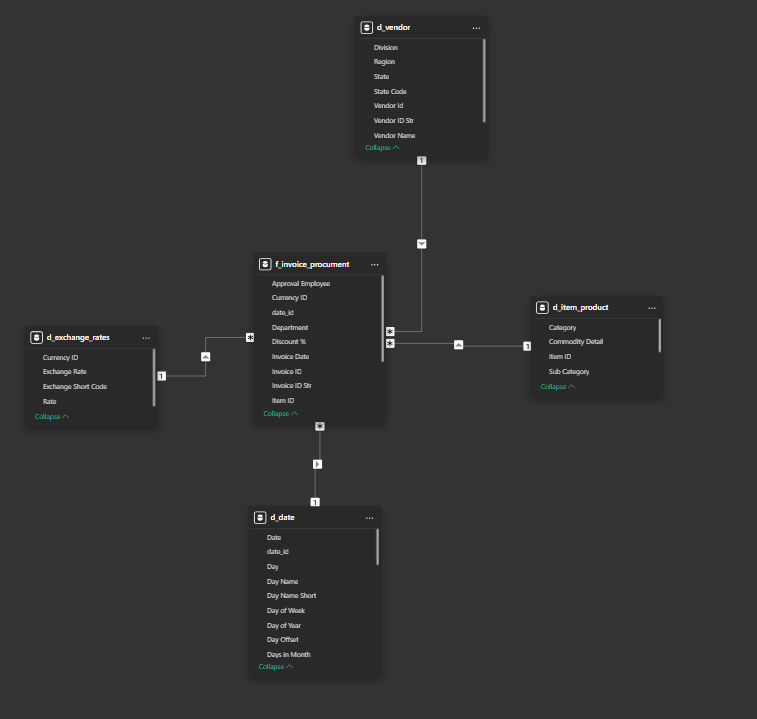
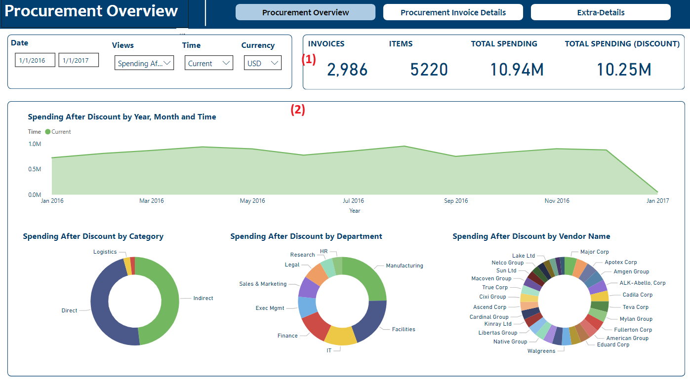
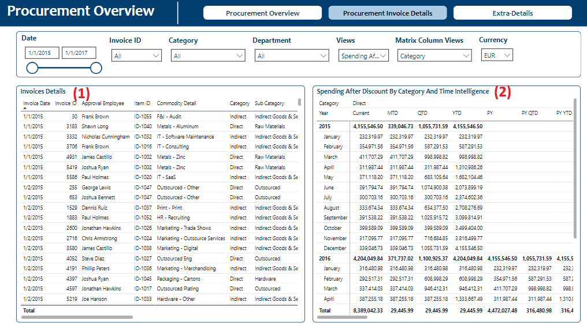
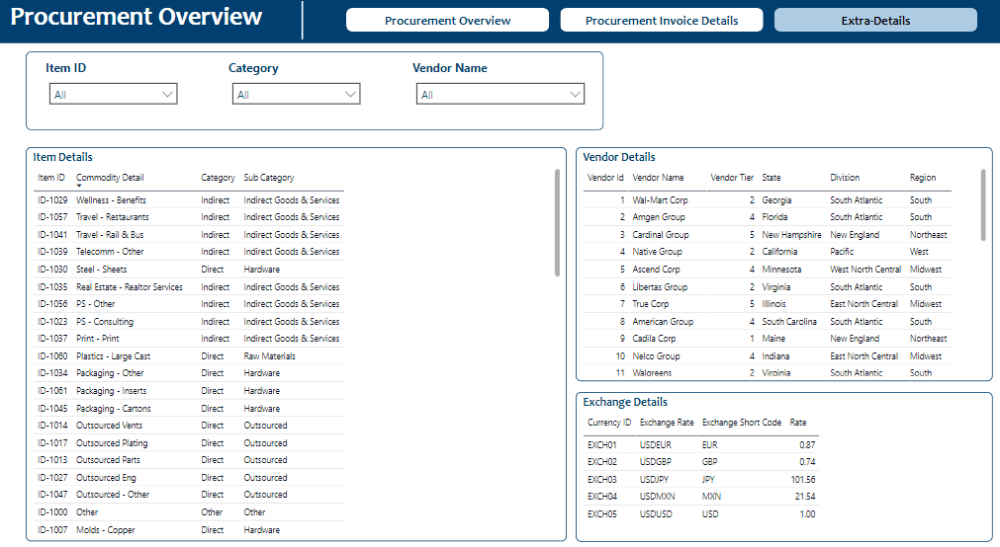

# Power BI Project: Procurement Report For Financial Tracking Team

# Project Overview
The goal of this project is to tracking internal procurement data for the facility and finance teams to improve decision-making and cost management.

This report provides insights into: 
- Monthly and Yearly spending trends
- Detailed breakdown of items purchased and quantities
- Analysis of completed invoices over time and by supplier
- Department-specific spending and supplier performance

# Dataset
Data Source: The data is located in data folder in the repository.

Data range: The data is collected from Jan-01 2015 to Jan-01 2017

# Data modeling
Using Star-schema method to modeling this data.

# Reports Pages
## Procurement Overview

(1): 
- Visualizations: Containing 4 cards visualizations. 
- Purpose: Track directly metrics
- Metrics: 
    - Invoices: The number of completed invoices
    - Items: The number of bought items
    - Total spending: Total spending over time
    - Total spending (discount): Total spending over time after subtraction discount

(2): 
- Visualizations: 1 line chart and 3 pie charts. Depending on Views Slicer, a measure will apply for this page. Besides Time Slicer will determine Time Intelligence that used
- Purpose: Analyze seasonal spending trends and Analyze some factors (Category, Department, Vendor) related
- Metrics: 
 - Views: Parameter table contains 4 metrics: Total invoices, total items, Total Spending and Total spending after Discount
## Procurement Invoice Details

This page contains a invoice detail table (1) and a matrix (2) to analyze some measures with some dimensions and time intelligence.
## Extra Details

The last page show data about item (product), vendor and exchange currency.

# Key Features and Functionality
- **Dynamic filter** by parameter table: User can filter data by various measure in same visuals e.g Total item, Total invoices, Total Spending, Total Spending Discount.

- **Time intelligence**: Includes metrics like MTD, YTD, PY, PY MTD, PT YTD, YOY, YOY%

- **Currency conversion slicer**: Users can use slicer to convert currency among USD, MXN, ... 

- **Drill-through capability**: Users can click on specific elements visualization in Procurement overview page to access detailed views in Procurement overview details

- **Drill-down capability**: Users can analyze more detail through dimensions on cols and rows in matrix visualization.

## Link Service and Setup Instructions
- Link PowerBI Service: https://app.powerbi.com/groups/me/reports/7eabc39e-4480-4a18-bb50-b88da577faf6?ctid=2dff09ac-2b3b-4182-9953-2b548e0d0b39&pbi_source=linkShare&bookmarkGuid=3d852d91-4b08-47fa-b202-c6834b38443d
- **Power BI Desktop**: Ensure you have the latest version of Power BI Desktop to open and edit the report.
- **Data Access Requirements**: You need modify data source in power query to get data.

## Author
Huu Tung Vu
- Linkedin: huu7ungvu
- X: huu7ungvu
- Github: huu7ungvu

## Additional Notes
This project is for demonstration purposes, and the data is not representative of any real company's procurement activities.